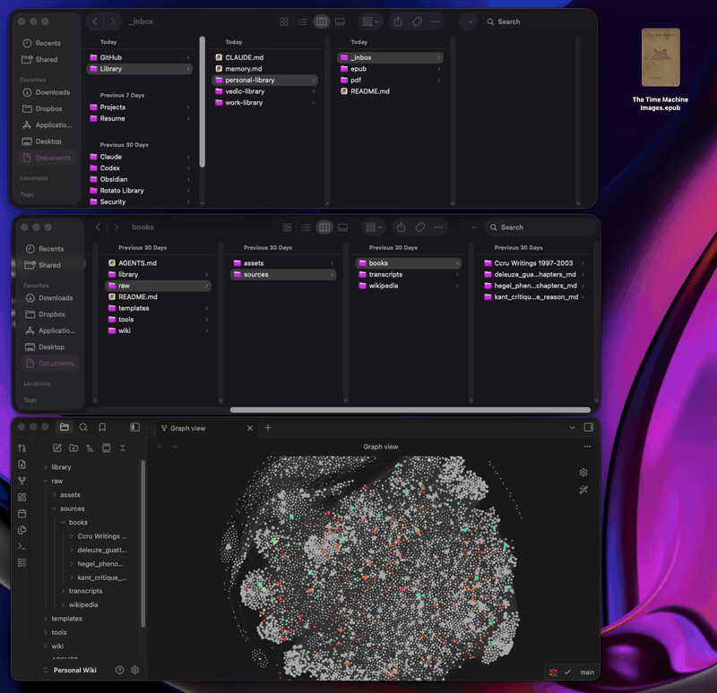

# 📚 obsidian-bookshelf

**Drop an EPUB, PDF, MOBI, or DjVu into a folder. Get clean, per-chapter Markdown in your Obsidian vault — automatically. Scanned PDFs get OCR'd.**



A small, local, no-cloud pipeline for turning a shelf of ebooks into a linkable
knowledge base. You drop a book into an inbox folder; a background watcher splits
it into one Markdown file per chapter and files it into the right Obsidian vault.
The original book stays in your library — only the Markdown goes to the vault.

Built for people who use Obsidian as a research or work knowledge base and want
their books to live there as searchable, linkable, citable notes.

## Where this fits

This is **only the ingestion step**. It transforms books in different formats
(EPUB, PDF, MOBI, DjVu, and other Calibre formats — OCR'ing scans along the way)
into clean per-chapter `.md` — raw material ready to be fed into an
**LLM-readable knowledge wiki** in Obsidian. It is not the wiki itself.

The approach is inspired by Andrej Karpathy's thinking that knowledge bases are
increasingly built to be *read by LLMs*, not only by people — a curated corpus
your models can ingest and reason over. `obsidian-bookshelf` gets your books into
that corpus; how you structure, link, and query the wiki on top is a separate layer.

---

## How it works

A book passes through three places:

```
  your library                 the engine                 your Obsidian vault
 ┌──────────────┐   drop    ┌──────────────────┐  files  ┌──────────────────────┐
 │  _inbox/      │ ───────►  │ EPUB → split      │ ──────► │ raw/sources/books/    │
 │  epub/        │           │ PDF  → EPUB→split │         │   <book>_md/          │
 │  pdf/         │ ◄──────── │ (Calibre+pandoc)  │         │     chapters/         │
 └──────────────┘  source    └──────────────────┘         │     images/  README   │
                   filed back                              └──────────────────────┘
```

- **EPUB** → split into per-chapter Markdown (using its table of contents).
- **PDF with text** → Calibre → EPUB → split.
- **Scanned PDF** (little/no extractable text) → [`ocrmypdf`](https://github.com/ocrmypdf/OCRmyPDF)
  adds a text layer → `pdftotext` pulls it → Markdown written directly, chunked by
  page range. (Calibre's PDF input discards OCR layers, so scans skip it. Calibre
  timing out on a "text" PDF also falls back to OCR.)
- **DjVu** → `ddjvu` → image PDF → the scan path above.
- **MOBI / AZW3 / FB2 / DOC / …** → Calibre → EPUB → split.

The result — `<book>_md/` with `chapters/`, `images/`, a `README.md`, and a
`.source` provenance marker — is built in staging and **moved into the vault
atomically**, so a concurrent reader never sees a half-written book. The original
source is filed into `<library>/<ext>/` (a Calibre conversion also leaves its EPUB
in `epub/_generated/`), and the inbox empties.

Re-dropping an already-converted book is skipped (matched by the `.source`
marker). Two different books that normalize to the same slug are kept apart with a
`_2`/`_3` suffix — nothing is silently overwritten. Concurrent drops are
serialized by a lock file.

---

## Requirements

- **Python 3.8+** — no pip packages needed (standard library only).
- **[pandoc](https://pandoc.org/)** — converts the book's HTML into Markdown (EPUB path).
- **[Calibre](https://calibre-ebook.com/)** — `ebook-convert`, for PDF / MOBI /
  AZW3 / etc → EPUB. EPUB-only setups can skip it.
- **[ocrmypdf](https://github.com/ocrmypdf/OCRmyPDF)** + **poppler** (`pdftotext`)
  — only for *scanned* PDFs and DjVu. Skip if you have no scans.
- **[DjVuLibre](http://djvu.sourceforge.net/)** (`ddjvu`) — only for `.djvu` files.

```bash
# macOS
brew install pandoc poppler
brew install --cask calibre
brew install ocrmypdf djvulibre      # optional: scans + djvu
```

Each tool is optional and degrades gracefully — without Calibre you still get
EPUBs; without ocrmypdf, scanned PDFs are parked instead of OCR'd; etc.

---

## Quick start

```bash
git clone https://github.com/cvdvs/obsidian-bookshelf.git
cd obsidian-bookshelf

cp config.example.ini config.ini   # then edit it (see below)
python3 install.py                  # creates folders; on macOS installs watchers
```

Now drop a book into any `<library>-library/_inbox/` and it converts on its own.
Prefer to run it by hand? `python3 scripts/process_inbox.py <library>`.

See [`examples/`](examples/) for a full walkthrough with a free Project Gutenberg book.

---

## Configuration

Everything lives in `config.ini` (copied from `config.example.ini`):

```ini
[paths]
library_root  = ~/Documents/Library      # holds your per-vault libraries
vault_root    = ~/Documents/Obsidian      # holds your Obsidian vaults
ebook_convert = /Applications/calibre.app/Contents/MacOS/ebook-convert  # blank = no PDF/MOBI/…
ocrmypdf  = ocrmypdf     # for scanned PDFs / djvu (default: PATH lookup)
pdftotext = pdftotext    # scan detection + OCR text extraction
ddjvu     = ddjvu        # .djvu → PDF
ocr_lang  = eng          # Tesseract language(s), e.g. eng+ron

[library:work]
vault_books_dir = Work Wiki/raw/sources/books   # where Markdown lands (under vault_root)
unsorted        = false

[library:personal]
vault_books_dir = Personal Wiki/raw/sources/books
unsorted        = true      # processed sources go to epub/_unsorted, for vaults
                            # that organize books into category subfolders
```

Each `[library:NAME]` creates a drop folder at `<library_root>/NAME-library/_inbox/`
and sends finished Markdown to `<vault_root>/<vault_books_dir>/`.

**Adding a library** is just another section in `config.ini` plus a re-run of
`python3 install.py`.

---

## Usage

```bash
# Process an inbox once
python3 scripts/process_inbox.py work

# Watch an inbox continuously (any OS — no LaunchAgent needed)
python3 scripts/process_inbox.py work --watch

# Use a specific config
python3 scripts/process_inbox.py work --config /path/to/config.ini
```

On **macOS**, `install.py` sets up a LaunchAgent per library so drops convert
automatically in the background. On **Linux/Windows**, create the folders with
`install.py` and run `--watch` (e.g. under systemd, Task Scheduler, or just a
terminal). Auto-watcher contributions for other platforms are welcome.

---

## What the conversion cleans up

EPUBs (and Calibre's PDF→EPUB output) carry a lot of styling cruft. The converter:

- strips leftover `<span class="...">` / `<div>` / `class=` wrappers — **but skips
  fenced ` ``` ` code blocks and inline `` `code` ``**, so HTML/CSS examples in
  technical books keep their attributes;
- merges bold/italic runs that those wrappers split apart;
- rejects file-path-as-title chapters (a Calibre PDF→EPUB quirk) and falls back to
  a real heading.

---

## Honest caveats

- **Scanned PDFs/DjVu are OCR'd**, but OCR output has no chapter structure (files
  are page ranges) and may contain recognition errors. A scan OCR genuinely can't
  read is parked in `<library>/pdf/_scanned-needs-ocr/` for manual attention.
- **OCR language defaults to English** (`ocr_lang` in config). Add others with
  `brew install tesseract-lang` and set e.g. `ocr_lang = eng+ron`.
- **PDFs/scans split into coarser chapters than EPUBs** (no real table of contents).
  Prefer a native EPUB when one exists.
- **`.zip` and other non-ebook containers are skipped** (logged). Convert by hand.
- This processes **your own** books. It hosts nothing and ships no content.

---

## Roadmap

Ideas on the list — contributions very welcome:

- **Category auto-sorter** — file processed source books into category subfolders
  automatically (e.g. from a metadata sheet) instead of by hand via `_unsorted/`.
- **Linux / Windows auto-watchers** — systemd and Task Scheduler equivalents of the
  macOS LaunchAgent (`--watch` already works everywhere in the meantime).
- **Filename normalization** — tidy messy source filenames so chapter-folder slugs
  come out clean.
- **More OCR languages out of the box** — currently configured via `ocr_lang`.

*Done:* OCR for scanned PDFs (ocrmypdf), DjVu (ddjvu), MOBI/AZW3/FB2/DOC and other
Calibre formats, collision-safe provenance, atomic publish.

---

## Contributing

Issues and PRs welcome — the Roadmap above is a good place to start. Keep it
dependency-light: Python standard library only, with external *command-line* tools
(pandoc, Calibre, ocrmypdf, ddjvu) shelled out to and each optional.

## License

[MIT](LICENSE) © 2026 Claudia Vaduvescu
